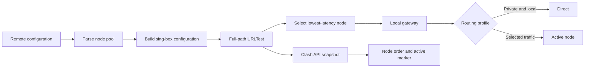

# Cloudflare Node Switch

A compact macOS menu-bar utility for managing a local node pool, checking full-path latency, and applying a routing profile.


## Highlights

- Automatic selection from sing-box URLTest results
- Strict lowest-latency selection with live active-node indication
- Separate full-path and TCP latency indicators
- Global, Smart CN, and AI Stable routing profiles
- Mixed HTTP/SOCKS5 and TUN inbound modes
- Country labels inferred from node IPs and cached locally
- System and developer-terminal integration
- Menu-bar operation without a permanent Dock icon
- English and Simplified Chinese app interface

## Flow



The node list and active marker use the same sing-box URLTest snapshot while the service is running. `Path` measures the complete routed request and drives Auto Select; `TCP` shows the direct socket handshake as a reference. Existing connections are preserved during a node change; new connections use the newly selected node.

## Requirements

- macOS 14 or newer
- Apple silicon for the prebuilt release archive
- Xcode Command Line Tools when building from source

The packaged app includes its sing-box runtime. A source build can also use a local installation from `PATH`.

## Install

Download the latest release archive, move **Cloudflare Node Switch.app** to Applications, and open it. The release uses ad-hoc signing, so macOS may require **Open** from the Finder context menu on first launch.

To build locally:

```sh
git clone https://github.com/Hilalum/CloudflareNodeSwitch.git
cd CloudflareNodeSwitch
swift test
script/package_app.sh
open "$HOME/Applications/Cloudflare Node Switch.app"
```

## Use

1. Add a remote configuration URL and refresh.
2. Choose an inbound and routing profile.
3. Start the local service.
4. Leave Auto Select enabled, or pin a node manually.

Mixed mode is recommended for normal desktop use. TUN mode changes system routing and may require elevated permissions.

## Routing Profiles

| Profile | Behavior |
| --- | --- |
| Global | Sends non-local traffic through the active node. |
| Smart CN | Keeps local, private, and common CN destinations direct. |
| AI Stable | Extends Smart CN with a focused set of service routes. |

Private addresses and local hostnames remain direct in every profile.

## Data and Storage

Runtime files are kept in:

```text
~/Library/Application Support/CloudflareNodeSwitch/
```

The country lookup sends only each node IP address to the lookup service. Results are cached locally. Remote configuration values are not included in screenshots or release materials.

## Development

```sh
swift build
swift test
```

The project is a SwiftPM macOS executable built with SwiftUI. Main responsibilities are separated across `AppState`, services, models, and views.

## License

Released under the [MIT License](LICENSE).

## Disclaimer

This software is provided as-is. Users are responsible for their configuration and for compliance with applicable policies and laws.
