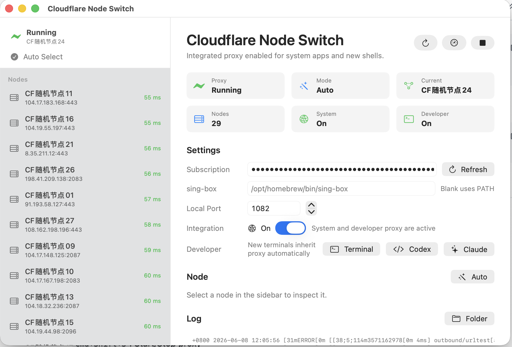

# Cloudflare Node Switch

[English](README.md) | [中文](README_CN.md)

一个 macOS SwiftUI 应用，用于管理 VLESS 订阅节点，支持智能延迟自动选择。



## 工作原理 — 自动选优流程

核心功能是**自动节点优化** — 应用持续测试所有可用的 Cloudflare 边缘节点，并实时将流量路由到最快的节点。

```
┌─────────────────────────────────────────────────────────────────┐
│                    Cloudflare Node Switch                       │
├─────────────────────────────────────────────────────────────────┤
│                                                                 │
│  ┌──────────────┐     ┌──────────────┐     ┌───────────────┐   │
│  │   订阅链接    │────▶│  解析 VLESS  │────▶│   节点池      │   │
│  │     URL       │     │     链接     │     │  (N 个节点)   │   │
│  └──────────────┘     └──────────────┘     └───────┬───────┘   │
│                                                     │           │
│                                                     ▼           │
│  ┌─────────────────────────────────────────────────────────┐    │
│  │                  sing-box urltest                        │    │
│  │                                                          │    │
│  │  ┌────────┐  ┌────────┐  ┌────────┐         ┌────────┐ │    │
│  │  │ 节点 1 │  │ 节点 2 │  │ 节点 3 │   ···   │ 节点 N │ │    │
│  │  │  55ms  │  │ 120ms  │  │  89ms  │         │ 200ms  │ │    │
│  │  │   ✓    │  │        │  │        │         │        │ │    │
│  │  └───┬────┘  └────────┘  └────────┘         └────────┘ │    │
│  │      │                                                  │    │
│  │      └──────────────────┬───────────────────────────────┘    │
│  │                         ▼                                    │    │
│  │                 ┌───────────────┐                            │    │
│  │                 │  选择最快节点  │◀── TCP 延迟测试 (1分钟)   │    │
│  │                 │               │◀── 容差阈值: 50ms         │    │
│  │                 └───────┬───────┘                            │    │
│  └─────────────────────────┼───────────────────────────────────┘    │
│                            ▼                                        │
│  ┌───────────────────────────────────────────────────────────┐     │
│  │                  127.0.0.1:7890                            │     │
│  │            混合 HTTP / SOCKS5 代理                          │     │
│  └─────────────────────────┬─────────────────────────────────┘     │
│                            ▼                                        │
│                ┌───────────────────┐                                │
│                │     系统代理       │                                │
│                │     + 开发者       │                                │
│                │     终端集成       │                                │
│                └───────────────────┘                                │
└─────────────────────────────────────────────────────────────────┘
```

### 选优算法

1. **获取订阅** — 解码 Base64 编码的订阅响应，提取 `vless://` 链接
2. **构建节点池** — 从订阅中解析所有可用的 Cloudflare 边缘节点
3. **延迟测试** — 通过 TCP 握手测量每个节点的真实连接时间
4. **自动选择** — sing-box `urltest` 持续监控并选择最快的节点
5. **故障转移** — 当前节点失败时，自动切换到下一个最优节点
6. **实时监控** — Clash API 追踪当前活跃节点，UI 每 3 秒更新

### 为什么对 Cloudflare 特别有效

- **边缘网络** — Cloudflare 在全球拥有 300+ 个边缘节点
- **动态分配** — 节点动态分配，延迟随时间变化
- **持续测试** — urltest 每分钟运行一次，50ms 容差阈值
- **智能路由** — 根据你的实际网络状况选择最优节点

## 功能特性

- **VLESS 订阅管理**：解析和管理 VLESS 订阅链接
- **智能节点选择**：基于 sing-box urltest 的延迟自动选择
- **实时延迟测试**：TCP 延迟测量，快速排序节点
- **系统集成**：无缝配置 macOS 系统代理
- **开发工具**：代理感知的终端集成，支持开发工作流
- **简洁 UI**：原生 SwiftUI 界面，侧边栏节点列表和详细配置

## 系统要求

- macOS 14 或更高版本
- Swift 工具链 / Xcode 命令行工具
- 安装 sing-box

使用 Homebrew 安装 sing-box：

```sh
brew install sing-box
```

## 安装

### 从源码构建

```sh
git clone https://github.com/Hilalum/CloudflareNodeSwitch.git
cd CloudflareNodeSwitch
swift build
```

### 创建应用包

```sh
script/package_app.sh
open "$HOME/Applications/Cloudflare Node Switch.app"
```

## 使用方法

1. 启动应用
2. 在设置面板中粘贴 VLESS 订阅 URL
3. 点击"Refresh"加载可用节点
4. 点击"Start"启动代理服务
5. 启用系统代理集成以自动配置

### 快捷键

- `Cmd+R`：刷新订阅
- `Cmd+Shift+S`：启动/停止代理
- `Space`：启动/停止代理（窗口聚焦时）

### 开发者集成

应用提供代理感知的终端集成，支持开发工具：

- **Terminal**：打开带有代理环境变量的新终端
- **Codex**：启动带有代理配置的 Codex
- **Claude**：启动带有代理设置的 Claude Code

## 配置

生成的配置和日志存储在：

```
~/Library/Application Support/CloudflareNodeSwitch/
```

### 代理设置

- **默认端口**：7890（可配置）
- **协议**：混合 HTTP/HTTPS/SOCKS5 代理
- **自动检测**：启用接口自动检测

### 节点选择模式

- **自动模式**：基于延迟测试的自动选择
- **手动模式**：固定节点选择，满足特定需求

## 架构

应用遵循清晰的 MVVM 架构：

- **AppState**：使用 Combine 发布者的中央状态管理
- **Views**：用户界面的 SwiftUI 组件
- **Services**：订阅解析、配置生成和系统集成的业务逻辑
- **Models**：代理节点和配置的数据结构

### 核心组件

- `SubscriptionService`：获取和解析 VLESS 订阅数据
- `SingBoxConfigBuilder`：从节点生成 sing-box 配置
- `SystemProxyManager`：管理 macOS 系统代理设置
- `DeveloperProxyManager`：处理终端代理集成

## 开发

### 前提条件

- Xcode 15.0+
- macOS 14.0+ SDK

### 构建

```sh
swift build
```

### 测试

```sh
swift test
```

### 创建发布版本

```sh
script/package_app.sh
```

## 许可证

本项目基于 MIT 许可证 - 详见 [LICENSE](LICENSE) 文件。

## 贡献

欢迎贡献！请随时提交 Pull Request。

1. Fork 仓库
2. 创建功能分支 (`git checkout -b feature/amazing-feature`)
3. 提交更改 (`git commit -m 'Add some amazing feature'`)
4. 推送到分支 (`git push origin feature/amazing-feature`)
5. 创建 Pull Request

## 免责声明

本软件"按原样"提供，不提供任何保证。作者对本软件的任何误用不承担责任。用户有责任确保遵守所有适用的法律和法规。

## 致谢

- [sing-box](https://sing-box.sagernet.org/) - 通用代理平台
- [VLESS Protocol](https://www.v2fly.org/en_US/v5/config/transport/vless.html) - 代理协议实现
- SwiftUI - Apple 的声明式 UI 框架
